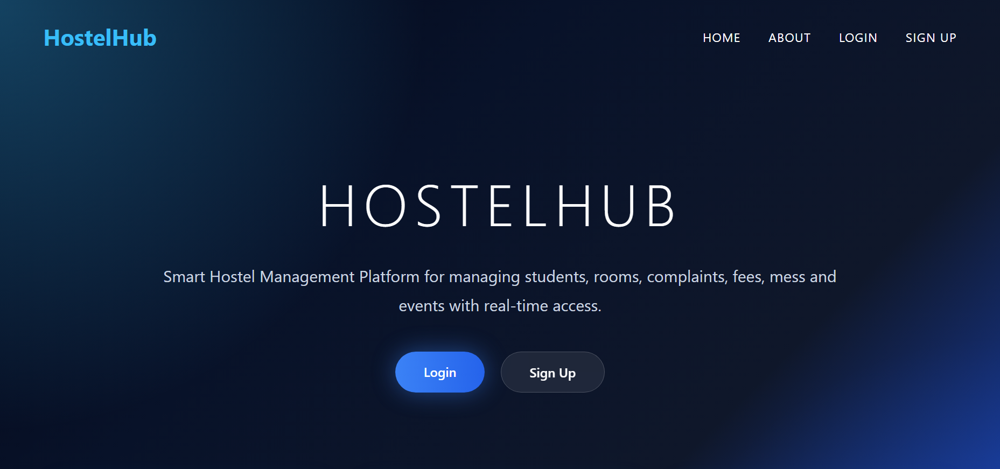
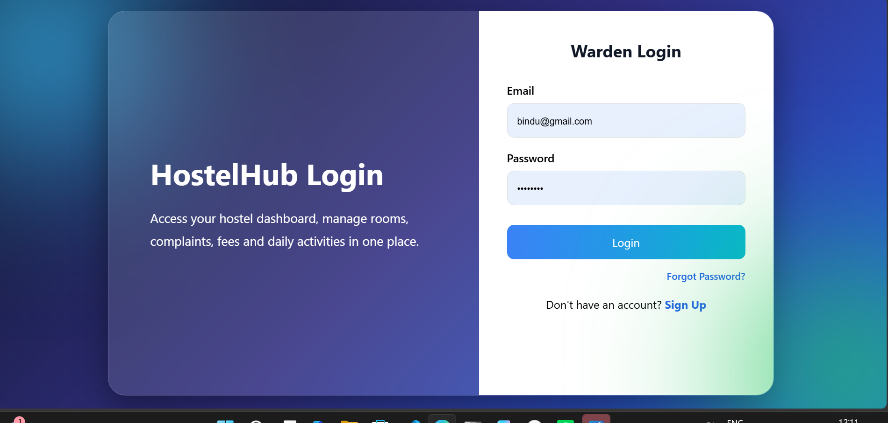
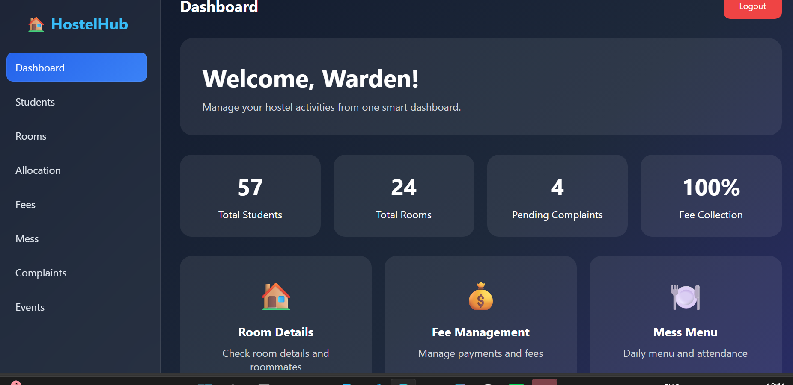
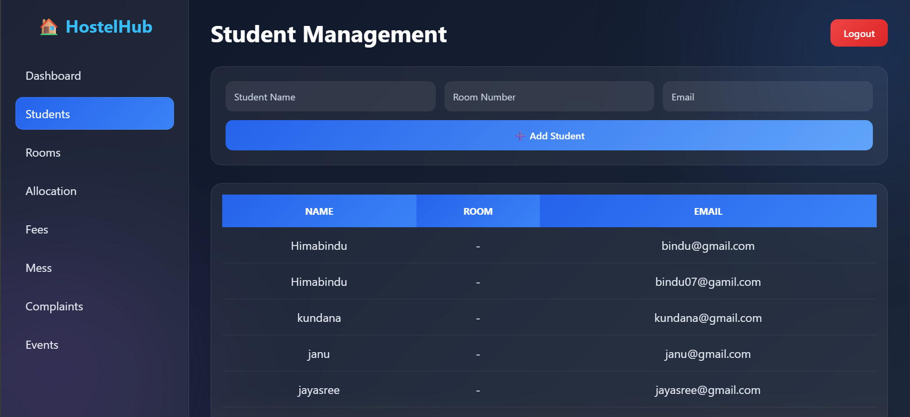
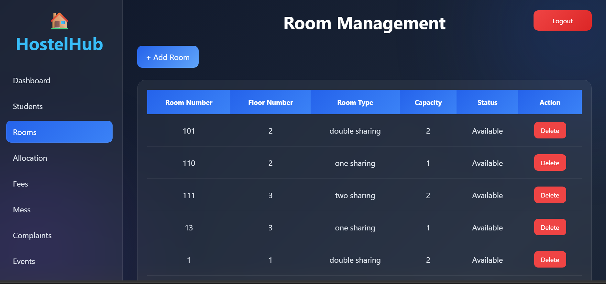
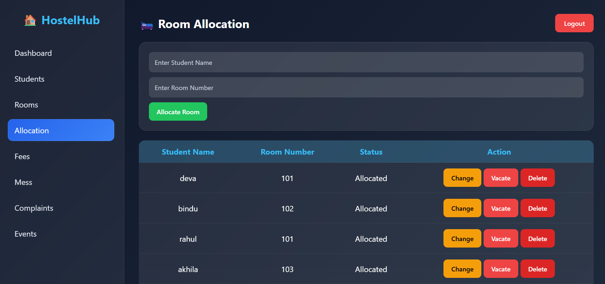
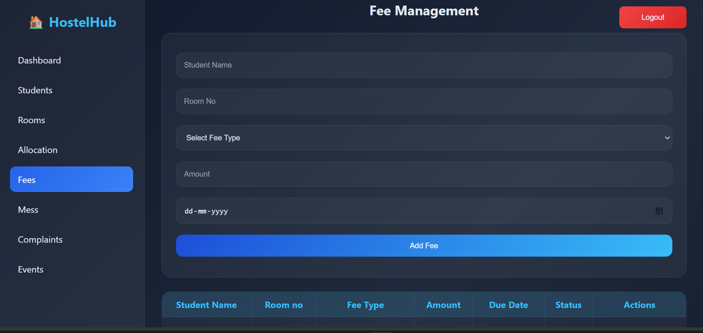
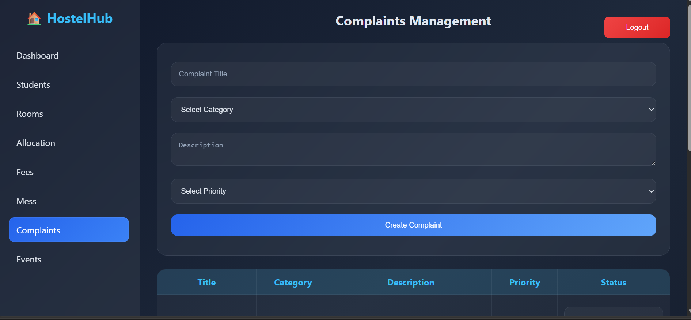
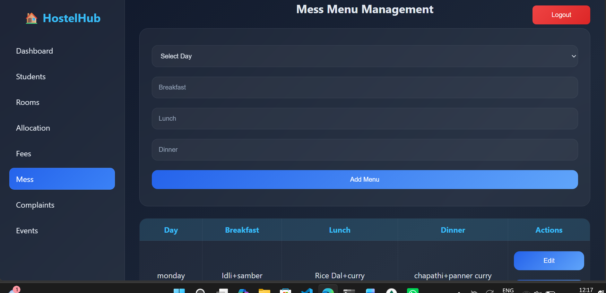
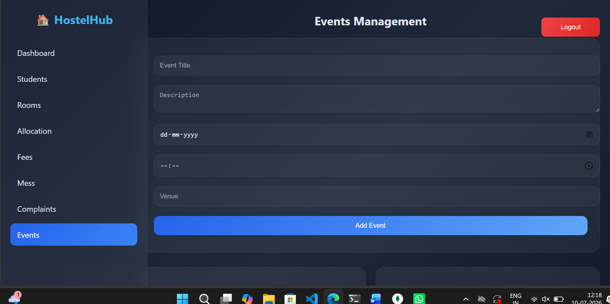

# 🏠 Hostel Management System

A modern **Hostel Management System** developed using **HTML, CSS, JavaScript, Node.js, Express.js, and MongoDB Atlas**. This application helps educational institutions efficiently manage hostel operations such as student records, room allocation, fee management, complaints, mess menu, and events through a centralized web platform.

---

# 📌 Project Overview

The Hostel Management System replaces manual hostel management processes with a digital solution. It provides an intuitive interface for administrators to manage hostel activities efficiently while maintaining accurate records.

---

# 🚀 Features

### 🔐 Authentication
- User Registration
- User Login
- Logout
- Role-Based Access

### 📊 Dashboard
- Modern Admin Dashboard
- Statistics Cards
- Quick Navigation
- Responsive Sidebar

### 👨‍🎓 Student Management
- Add Student
- View Students
- Edit Student
- Delete Student

### 🏠 Room Management
- Add Rooms
- Update Rooms
- Delete Rooms
- Room Status

### 🛏 Room Allocation
- Allocate Room
- Change Room
- Remove Allocation
- View Allocations

### 💰 Fee Management
- Add Fee Records
- View Fee Details
- Due Date Management

### 🍽 Mess Menu
- Weekly Menu
- Breakfast
- Lunch
- Dinner

### 🛠 Complaint Management
- Register Complaint
- Update Complaint Status
- Track Complaints

### 📅 Event Management
- Create Events
- View Events
- Delete Events

---

# 🛠 Technology Stack

## Frontend
- HTML5
- CSS3
- JavaScript

## Backend
- Node.js
- Express.js

## Database
- MongoDB Atlas
- Mongoose

## Tools
- Visual Studio Code
- Git
- GitHub
- Postman

---

# 📂 Project Structure

```
Hostel-Management-System
│
├── public
│   ├── login.html
│   ├── signup.html
│   ├── dashboard.html
│   ├── students.html
│   ├── rooms.html
│   ├── allocation.html
│   ├── fees.html
│   ├── mess.html
│   ├── complaints.html
│   ├── events.html
│   ├── css/
│   └── js/
│
├── models
│   ├── User.js
│   ├── Student.js
│   ├── Room.js
│   ├── Allocation.js
│   ├── Fee.js
│   ├── Complaint.js
│   ├── Mess.js
│   └── Event.js
│
├── server.js
├── package.json
├── package-lock.json
└── README.md
```

---

# 📦 Installation

## Clone Repository

```bash
git clone https://github.com/bindu352/hostel-management.git
```

---

## Navigate to Project

```bash
cd hostel-management
```

---

## Install Dependencies

```bash
npm install
```

---

## Configure MongoDB

Open **server.js** and replace the MongoDB connection string with your own MongoDB Atlas URI.

Example:

```javascript
mongoose.connect("YOUR_MONGODB_CONNECTION_STRING");
```

---

## Start Server

```bash
node server.js
```

or

```bash
npm start
```

---

## Open Browser

```
http://127.0.0.1:3000
```

---

# 🗄 Database Collections

- Users
- Students
- Rooms
- Allocations
- Fees
- Complaints
- Mess Menu
- Events

---

# 📡 REST API Endpoints

## Authentication

| Method | Endpoint |
|---------|----------|
| POST | /signup |
| POST | /login |

---

## Students

| Method | Endpoint |
|---------|----------|
| GET | /students |
| POST | /students |
| PUT | /students/:id |
| DELETE | /students/:id |

---

## Rooms

| Method | Endpoint |
|---------|----------|
| GET | /rooms |
| POST | /rooms |
| PUT | /rooms/:id |
| DELETE | /rooms/:id |

---

## Room Allocation

| Method | Endpoint |
|---------|----------|
| GET | /allocations |
| POST | /allocate-room |
| PUT | /change-room/:id |
| DELETE | /allocations/:id |

---

## Fees

| Method | Endpoint |
|---------|----------|
| GET | /fees |
| POST | /fees |

---

## Mess Menu

| Method | Endpoint |
|---------|----------|
| GET | /mess |
| POST | /mess |

---

## Complaints

| Method | Endpoint |
|---------|----------|
| GET | /complaints |
| POST | /complaints |
| PUT | /complaints/status/:id |

---

## Events

| Method | Endpoint |
|---------|----------|
| GET | /events |
| POST | /events |

---

# 💻 User Interface

- Professional Dashboard
- Dark Theme
- Fixed Sidebar
- Responsive Layout
- CRUD Operations
- Interactive Cards
- Modern Forms

---


## 📸 Project Screenshots

### Home Page


### Login Page


### Dashboard


### Student Management


### Room Management


### Room Allocation


### Fee Management


### Complaint Management


### Mess Menu


### Event Management


---


---

# 🎯 Future Enhancements

- Visitor Management
- Online Fee Payment
- Email Notifications
- Reports & Analytics
- QR Code Integration
- Mobile Application

---

# 📚 Learning Outcomes

- Full Stack Development
- REST API Development
- MongoDB Integration
- Express.js
- Node.js
- CRUD Operations
- Responsive Web Design
- Git & GitHub
- Backend Development

---

# 👨‍💻 Developer

**Sivaram**

GitHub: https://github.com/bindu352

---

# ⭐ Support

If you like this project, don't forget to ⭐ star the repository.
